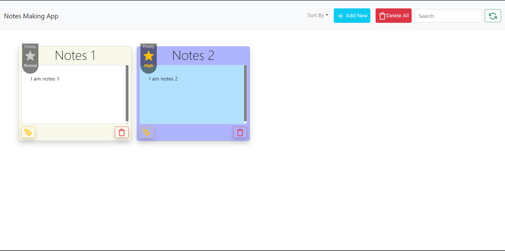

# Note-Making App
A react app made to do CRUD operation of Notes.

## Live Link
Access this [webApp](https://note-making-app-shah.netlify.app)

## Table of Context:

-[About the App](#about-the-app)

-[Screentshot](#screenshot)

-[Technologies](#technologies)

-[Setup](#setup)

-[Status](#status)

## About the App
A React app made to do CRUD operation of Notes and have functionality of sorting with themes of aparticular note and data stored in Local Storage.

## Screenshot

## Technologies
HTML, CSS, Bootstrap, JS and React
## Setup
- download or clone the repository
- run `npm install`

## Status
Completed
